# DDGo

> 클라이밍 시도 영상을 업로드하거나 실시간으로 녹화하면, 온디바이스 AI와 MuJoCo 물리 분석을 통해 실패 원인과 신체 부하를 분석하고 다음 시도를 더 효율적으로 오를 수 있도록 피드백을 제공하는 Android 기반 클라이밍 트레이닝 서비스입니다.

- **프로젝트**: SSAFY 특화 프로젝트 D204
- **팀명**: cLAB(클랩)
- **서비스명**: DDGo
- **개발 기간**: 2026.02.24 ~ 2026.04.02
- **개발 인원**: 6명
- **클라이언트**: Android App + Wear OS App
- **서버**: Spring Boot API Server + FastAPI AI Inference Server
- **담당 역할**: Android/Wear 앱, 온디바이스 영상 전처리, AI 분석 연동, 분석 결과 화면
- **핵심 가치**: 클라이밍 시도 기록, 홀드 탐지, 자세 분석, 다음 시도 피드백, 신체 부하 관리

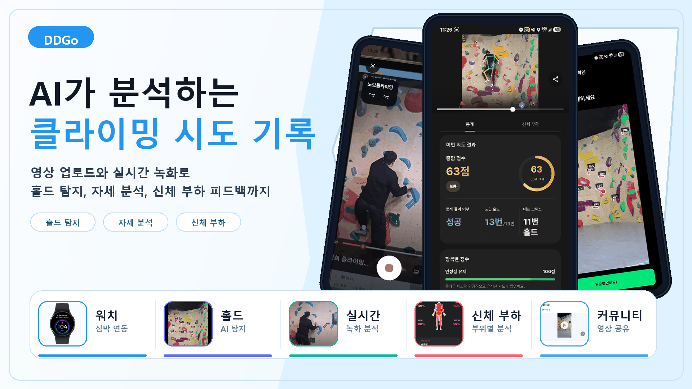

## 목차

- [기획 배경](#기획-배경)
- [서비스 소개](#서비스-소개)
- [주요 화면 및 기능 소개](#주요-화면-및-기능-소개)
- [프로젝트 핵심 기술](#프로젝트-핵심-기술)
- [시스템 아키텍처](#시스템-아키텍처)
- [API 개요](#api-개요)
- [프로젝트 구조](#프로젝트-구조)
- [로컬 실행](#로컬-실행)
- [기술 스택](#기술-스택)
- [개발 문서](#개발-문서)
- [팀원 소개](#팀원-소개)

## 기획 배경

클라이밍은 같은 문제를 반복해서 시도하고, 실패 지점을 찾아 움직임을 개선하는 스포츠입니다. 하지만 일반 사용자가 자신의 등반 영상을 보고 어떤 홀드에서 자세가 무너졌는지, 어느 신체 부위에 부하가 몰렸는지, 다음 시도에서 무엇을 바꿔야 하는지 정량적으로 파악하기는 어렵습니다.

DDGo는 사용자가 직접 촬영한 클라이밍 영상을 기반으로 자세와 홀드 상호작용을 분석하고, 다음 시도에서 어떤 움직임을 바꾸면 더 효율적으로 오를 수 있는지 알려주기 위해 기획했습니다. 사용자는 문제를 업로드하거나 실시간으로 녹화하고, 서비스는 홀드 탐지, 자세 추출, 실패 원인 분석, 다음 시도 피드백, 커뮤니티 공유까지 하나의 흐름으로 제공합니다.

## 서비스 소개

DDGo는 클라이밍 문제 생성부터 영상 분석, 다음 시도 피드백, 커뮤니티 공유까지 이어지는 모바일 서비스입니다.

사용자는 암장을 선택하고 문제 난이도와 홀드 색상을 지정한 뒤, 영상에서 탐지된 홀드를 보정하고 시작 홀드와 종료 홀드를 선택합니다. 이후 업로드 영상 또는 실시간 녹화 영상을 기반으로 자세 분석이 진행되며, 안정성 점수, 부하 분포, 핵심 장면, 실패 원인, 다음 시도에서 개선할 움직임을 확인할 수 있습니다.

Android 앱은 MediaPipe와 TFLite 모델을 사용해 일부 영상 전처리를 온디바이스에서 수행합니다. Spring Boot 서버는 사용자, 암장, 챌린지, 시도, 커뮤니티 데이터를 관리하고, FastAPI AI 서버는 MuJoCo 기반 물리 분석과 실시간 세션 분석을 담당합니다. Wear OS 앱은 등반 중 진동과 녹화 상태를 보조적으로 동기화합니다.

## 주요 화면 및 기능 소개

### 회원가입 및 온보딩

| 신체 정보 입력 | 암장 선택 및 프로필 설정 |
| --- | --- |
| 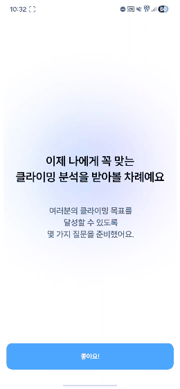 | 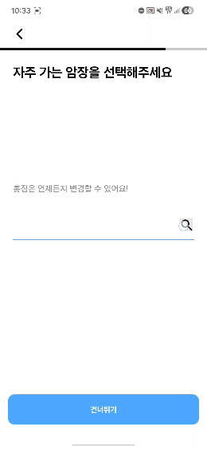 |
| 키, 몸무게, 윙스팬 등 분석에 필요한 사용자 신체 정보를 입력합니다. | 자주 가는 암장과 닉네임을 설정해 개인화된 분석 환경을 준비합니다. |

### 클라이밍 기록 생성

| 실시간 녹화 분석 | 영상 업로드 및 홀드 탐지 |
| --- | --- |
| 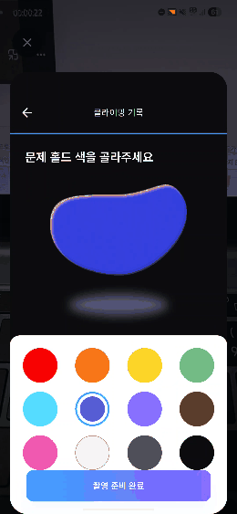 | 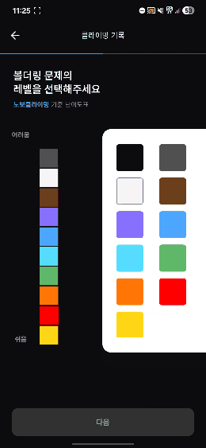 |
| CameraX 기반 녹화 중 자세 프레임을 수집하고, 등반 종료 후 분석 흐름으로 이어집니다. | 업로드 영상에서 베스트 프레임을 찾고, YOLO 기반 홀드 탐지 결과를 사용자가 보정합니다. |

### 분석 리포트

| 시도 분석 리포트 | 신체 부위별 부하 | 기록 및 통계 |
| --- | --- | --- |
| 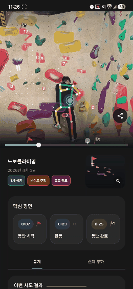 | 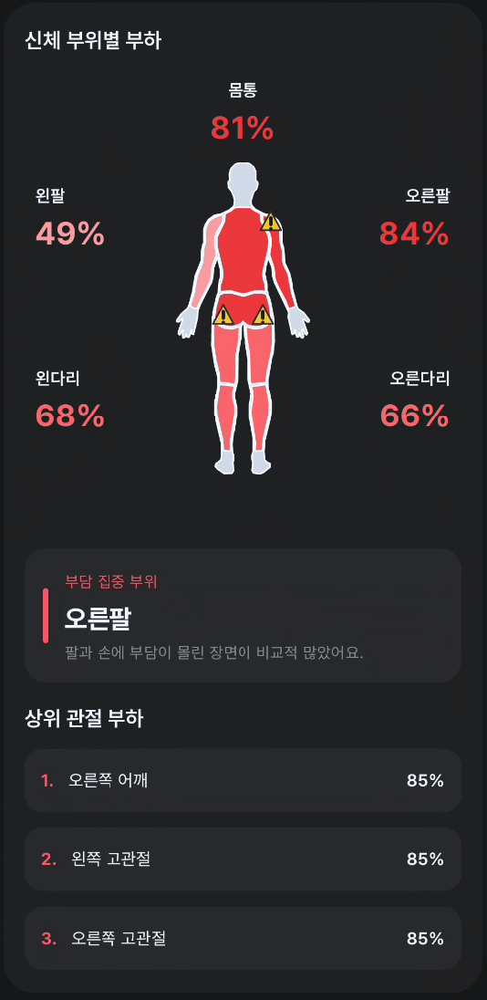 | 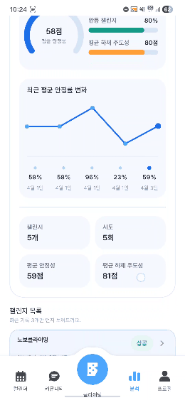 |
| 자세 오버레이, 핵심 장면, 안정성 그래프와 다음 시도 피드백을 한 화면에서 확인합니다. | 몸통, 팔, 다리 등 부위별 부하를 색상과 퍼센트로 보여주고 다음 시도에서 부담을 줄일 부위를 안내합니다. | 최근 시도의 평균 안정성, 시도 횟수, 성공 여부, 부하 지표를 누적 기록으로 보여줍니다. |

### Wear OS 연동

| 갤럭시 워치 연동 |
| --- |
| 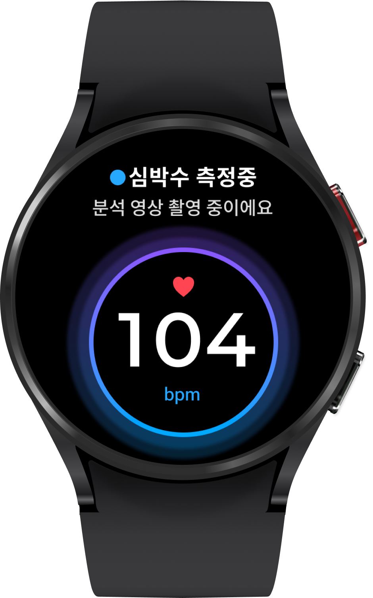 |
| Wear OS 앱은 등반 중 심박수를 측정하고, Android 앱의 녹화 상태와 동기화해 위험 상황에서 진동 경고를 제공합니다. |

### 커뮤니티 공유

| 분석 영상 공유 |
| --- |
| 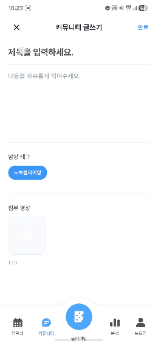 |
| 분석이 끝난 시도 영상을 커뮤니티 게시글로 공유하고, 다른 사용자와 문제 풀이 경험을 나눌 수 있습니다. |

## 프로젝트 핵심 기술

### 온디바이스 AI 기반 영상 전처리

DDGo는 모든 분석을 서버로만 넘기지 않고, Android 앱에서 MediaPipe와 TFLite 모델을 사용해 분석에 필요한 핵심 데이터를 먼저 만듭니다.

| 모델/로직 | 역할 |
| --- | --- |
| MediaPipe Pose Landmarker | 2D/3D 자세 랜드마크 추출 |
| YOLOv8 Person Detector | 영상 내 사람 감지 및 유효 프레임 판단 |
| YOLO11 Hold Detector | 클라이밍 홀드 segmentation 탐지 |
| Hold Color Classifier | 선택한 난이도 색상 기반 홀드 필터링 |
| Best Frame Selection | 홀드 탐지에 적합한 대표 프레임 추출 |

### MuJoCo 기반 물리 분석 서버

FastAPI AI 서버는 Android에서 전달한 자세 시퀀스, 홀드 정보, 사용자 신체 정보를 바탕으로 등반 동작을 분석합니다.

```text
holds_json + pose3d_sequence_json + user_body_json
  -> MediaPipe 3D 좌표 보정
  -> 홀드 polygon 접촉 추적
  -> MuJoCo articulated human fitting
  -> inverse dynamics / support stability 분석
  -> crux 후보와 다음 시도 피드백 리포트 생성
```

분석 API는 빠른 분석과 physics 분석을 분리해 사용합니다. 대용량 요청은 gzip variant로 전송할 수 있고, 실시간 녹화는 session start, pose chunk append, context attach, finalize 단계로 처리합니다.

### Android / Wear 공통 계약 분리

Android 앱과 Wear OS 앱이 공유하는 상태는 `core-shared` 모듈로 분리했습니다. 심박, 알림, 녹화 상태, watch session status 같은 계약을 한 곳에서 관리해 양쪽 앱의 동기화 오류를 줄였습니다.

### 기술적 도전과 해결

| 도전 과제 | 해결 방향 |
| --- | --- |
| 영상 분석 대기 시간이 길어지는 문제 | MediaPipe, TFLite, YOLO 기반 전처리를 Android에서 먼저 수행해 서버로 전달할 데이터를 줄였습니다. |
| 클라이밍 동작을 단순 포즈 점수로 설명하기 어려운 문제 | MuJoCo 기반 인체 모델 fitting과 inverse dynamics 분석을 결합해 안정성, crux, 신체 부하, 다음 시도 피드백을 리포트로 변환했습니다. |
| 녹화 중 모바일과 워치 상태가 어긋나는 문제 | Android/Wear 공통 계약을 `core-shared`로 분리하고 Data Layer 기반 녹화 상태, 심박, 경고 상태를 동기화했습니다. |

## 시스템 아키텍처

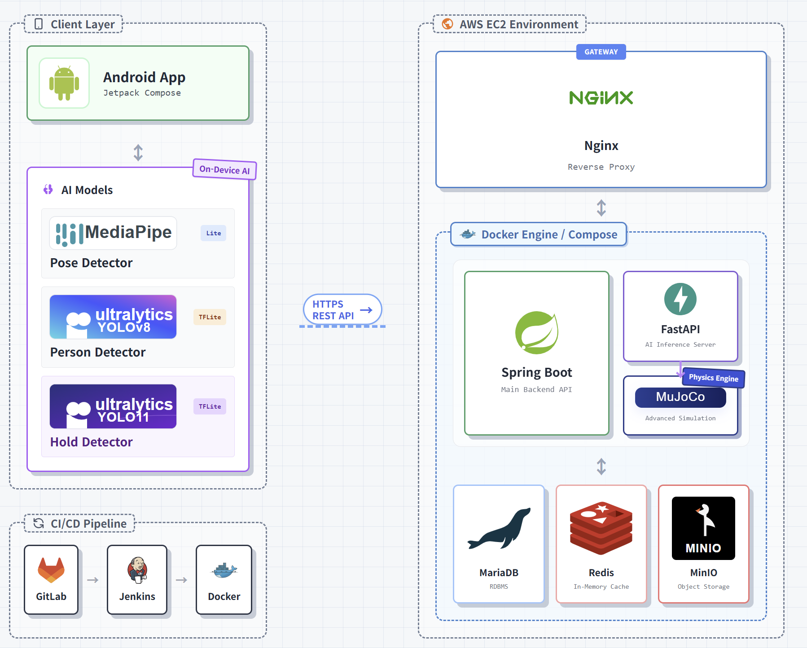

```text
Android App
  ├─ Jetpack Compose UI
  ├─ CameraX / Media3
  ├─ MediaPipe Pose
  ├─ TFLite Person Detector
  ├─ TFLite Hold Detector
  └─ Wear OS Data Layer

HTTPS / REST API

Nginx Reverse Proxy
  ├─ Spring Boot API Server
  │  ├─ MariaDB: 사용자, 암장, 챌린지, 시도, 커뮤니티
  │  ├─ Redis: 토큰/캐시성 상태
  │  └─ MinIO: 영상/커뮤니티 미디어 오브젝트 스토리지
  └─ FastAPI AI Server
     ├─ MuJoCo physics pipeline
     ├─ batch analyze API
     └─ realtime session API
```

## API 개요

### Spring Boot API

| 도메인 | 주요 경로 | 설명 |
| --- | --- | --- |
| Users | `/v1/users/**` | 회원가입, 로그인, 소셜 로그인, 토큰 재발급, 프로필 온보딩 |
| Gyms | `/v1/gyms/**` | 암장 resolve, 암장별 난이도 조회 |
| Challenges | `/v1/challenges/**` | 챌린지 생성, 홀드 저장, 종료, 요약/상태 조회 |
| Attempts | `/v1/attempts/**` | 시도 생성, 분석 상태, 결과 조회, 영상 업로드 완료 |
| Attempt Video | `/v1/attempts/{attemptId}/video-url`, `/v1/attempts/{attemptId}/video-upload-complete` | 시도 영상 업로드 URL 발급과 업로드 완료 처리 |
| Community Media | `/v1/community/media/video-urls` | 커뮤니티 첨부 영상 업로드 URL 발급 |
| Community | `/v1/community/**` | 게시글, 댓글, 좋아요, 첨부 영상 |

### FastAPI AI Server

| 경로 | 설명 |
| --- | --- |
| `/api/v1/mujoco-complete/analyze/fast` | 홀드, 자세, 신체 정보 기반 빠른 MuJoCo 분석 |
| `/api/v1/mujoco-complete/analyze/physics` | MuJoCo 기반 physics 분석 |
| `/api/v1/mujoco-complete/session/start` | 실시간 분석 세션 시작 |
| `/api/v1/mujoco-complete/session/{session_id}/pose-chunks` | 실시간 자세 프레임 chunk 누적 |
| `/api/v1/mujoco-complete/session/{session_id}/context` | 홀드 선택 context 연결 |
| `/api/v1/mujoco-complete/session/{session_id}/finalize` | 실시간 분석 최종화 |
| `/api/v1/mujoco-complete/session/{session_id}` | 실시간 세션 중단 및 삭제 |

## 프로젝트 구조

```text
DDGo/
├─ DDGo/                         # Spring Boot backend
│  ├─ src/main/java/com/ssafy/ddgo
│  └─ src/test
├─ DDGo_android/                 # Android / Wear client
│  ├─ app                         # Android Compose app
│  ├─ core-shared                 # Android-Wear shared contracts
│  └─ wear                        # Wear OS companion app
├─ DDgo_AI_Server/               # FastAPI + MuJoCo AI server
│  ├─ app
│  ├─ config
│  └─ requirements.txt
├─ DDgo_AI_yolo/                 # YOLO hold model porting guide
├─ mujoco/                       # MuJoCo analysis experiments
├─ docs/demo/                    # README demo GIFs
└─ exec/                         # deployment docs, ERD, architecture assets
```

## 로컬 실행

### Backend

```bash
cd DDGo
./gradlew bootRun
```

필요한 환경 변수와 운영 설정은 `exec/포팅매뉴얼.md`를 기준으로 구성합니다.

### Android

```bash
cd DDGo_android
./gradlew assembleDebug
```

Android Studio에서 `app` 모듈을 실행하면 모바일 앱을, `wear` 모듈을 실행하면 Wear OS 앱을 확인할 수 있습니다. 로컬 개발용 서버 주소와 릴리즈 키 설정은 `DDGo_android/local.properties` 또는 Gradle signing 설정을 사용합니다.

### AI Server

```bash
cd DDgo_AI_Server
python -m venv .venv
source .venv/bin/activate
pip install -r requirements.txt
uvicorn app.main:app --reload --host 0.0.0.0 --port 8000
```

Windows PowerShell에서는 가상환경 활성화 명령을 `.venv\Scripts\Activate.ps1`로 바꿔 실행합니다.

## 기술 스택

| 영역 | 기술 |
| --- | --- |
| Android | Kotlin, Jetpack Compose, CameraX, Media3, Retrofit, Room, DataStore, Hilt |
| Wear OS | Kotlin, Jetpack Compose for Wear OS, Google Play Services Wearable Data Layer |
| Backend | Java 17, Spring Boot, Spring Security, JPA, QueryDSL, Gradle |
| AI Server | Python, FastAPI, NumPy, MuJoCo, MediaPipe schema processing |
| ML / CV | MediaPipe Pose, TFLite, YOLOv8, YOLO11 segmentation |
| Infra | MariaDB, Redis, MinIO, Nginx, Docker |
| Collaboration | GitLab, Jira, Notion, Figma |

## 개발 문서

- [시스템 아키텍처](./exec/System-Architecture.png)
- [포팅 매뉴얼](./exec/포팅매뉴얼.md)
- [DB DDL](./exec/DDGo.sql)
- [DB Seed SQL](./exec/ddgo_seed_inserts.sql)
- [발표용 데모 Seed SQL](./exec/presentation_demo_seed.sql)

## 팀원 소개

<table>
  <tr>
    <td align="center" width="16.6%">
      <br />
      <strong>이건</strong><br />
      팀장 / Full-stack
    </td>
    <td align="center" width="16.6%">
      <br />
      <strong>이태희</strong><br />
      Full-stack
    </td>
    <td align="center" width="16.6%">
      <br />
      <strong>박준영</strong><br />
      AI / Backend
    </td>
    <td align="center" width="16.6%">
      <br />
      <strong>김대규</strong><br />
      Android
    </td>
    <td align="center" width="16.6%">
      <br />
      <strong>김유빈</strong><br />
      Android
    </td>
    <td align="center" width="16.6%">
      <br />
      <strong>이혜빈</strong><br />
      AI / Android
    </td>
  </tr>
</table>
